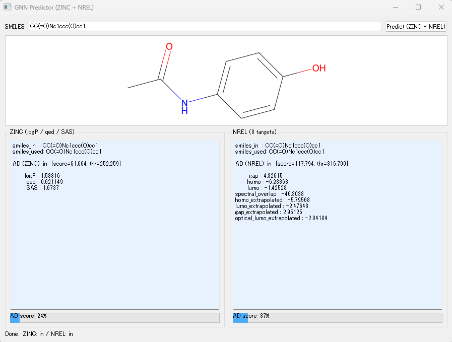
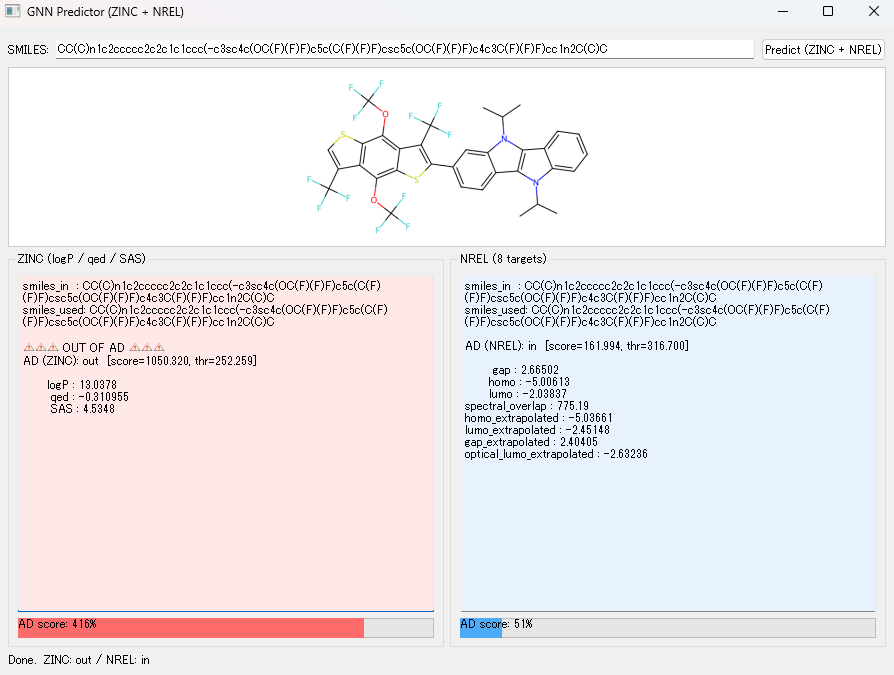
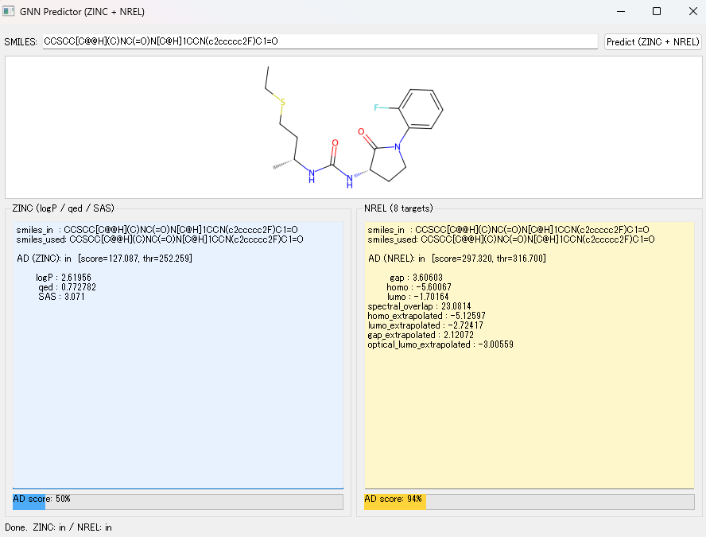
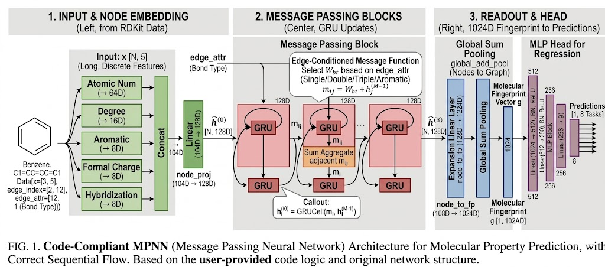
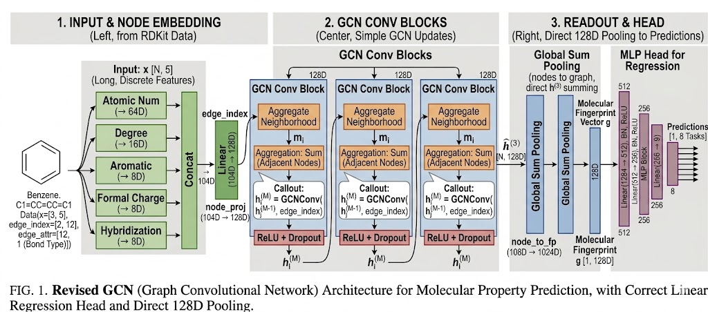
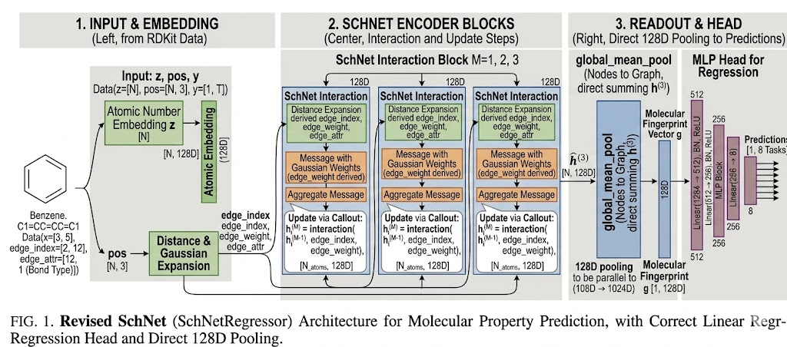

# GNN-based Molecular Property Prediction + GUI Inference

このレポジトリは、以下を提供します
- 様々なGNNモデルを実装するためのJupyter notebooks
- 学習済みMPNNモデルによる単分子予測GUI

おすすめの実行順としては、
- notebook/NREL シリーズ：太陽電池材料の計算値を予測するモデル、MPNN, GCN, ScheNetの学習を行います。MPNNモデルに関しては、出力の内容を生かしてAD（Appication Domain）の作成も行います。これはGUIにて使用します。
- notebook/zinc シリーズ：創薬関連のデータセットにおける薬特性を予測するモデル。こちらもADモデルを作成し、GUIにて使用します。
- src/predict_gui.py : 上記2つのnotebookにより学習されたモデルを使った物性予測GUIです。自分の好きな分子を入力し、物性を予測することができます。
- notebook/Deep4Chemシリーズ：PL波長予測モデル。おまけ。

> **Hardwareに関する注意**  
> 学習用のnotebookはGPU使用を強く推奨します、一方でGUIはCPUのみでも使用可能です。  
> GUIはローカルの Miniforge/Conda 環境でのみ動作確認済みです（dockerコンテナ環境では動きません）

## レポジトリ構成

- `.devcontainer/`
  - `Dockerfile`, `devcontainer.json`, `environment.yml` (学習notebooks用)
- `notebook/*.ipynb`
  - 学習/評価/AD用のnotebooks
- `models/`
  - 学習済みmodel
- `src/predict_gui.py`
  - 学習済みMPNNモデルを使用したGUIアプリ
- `src/gnn_infer.py`
  - GUI/ノートブックで使用される推論ユーティリティ
- `environment_gui.yml` : GUI用conda環境yml


## Quick Start A: Notebooks (Dev Container)

### Requirements
- VS Code
- Dev Containers extension (Remote - Containers)

### Steps
1. このレポジトリをVS codeで開いてください
2. **"Reopen in Container"**を実行してください
3. Data and Model Directories/Datasets の引用先から必要なdatasetのcsvファイル（NRELやzinc）をダウンロードしてください、レポジトリのルートに`data`ディレクトリを作って、ダウンロードしたcsvを格納してください
4. notebook(`notebook/*.ipynb`)を開いてセルを実行してください

Notes:
- Dev container environment（dockerコンテナ環境）は `.devcontainer/environment.yml` で定義されています。
- ノートブックは、**リポジトリのルート**を作業ディレクトリとして想定します。

## Quick Start B: GUI (Local Miniforge/Conda)
事前学習済みモデルが利用可能な場合、このGUIアプリケーションを使用して様々な分子特性を予測できます。

### Requirements
- Miniforge (or Anaconda/Miniconda)
- Windows/macOS/Linux supported (tested primarily on local Conda)

### Environment setup
YAMLファイルからGUI用のConda環境を作成します（「Conda YAMLのエクスポート」セクションを参照）。

Example:
```bash
conda env create -f environment_gui.yml
conda activate <ENV_NAME>
```

### Run GUI
上記で作ったcondaの環境に入ったら、
リポジトリのルートディレクトリから以下のコマンドで実行してください：
```bash
python -m src.predict_gui
```
注記：
- GUIはdockerコンテナ内では動作しません、conda環境で実行してください
- `python predict_gui.py`は必ずリポジトリのルートディレクトリ（現在の作業ディレクトリが重要です）から実行してください。

### Step-by-step Usage

1. SMILES文字列を入力
予測したい分子のSMILES表現を入力欄に貼り付けてください。

2. 予測を実行
“Predict (ZINC + NREL)” ボタンをクリックしてください。

3. 予測結果の表示
分子構造と予測結果が表示されます：
    - 左側 (ZINC model)
    ZINCデータセットで学習させたGNNによる予測結果、3つの薬特性を示す
    (logP, QED, SAS).

    - 右側 (NREL model)
    NRELデータセットで学習させたGNNによる予測結果、太陽電池に関連する8つの特性を示す

### Applicability Domain (AD) Evaluation

各GNNモデルについて、学習データのreadout層埋め込み分布に基づいて Applicability Domain (AD) を定義しています。

- まず、学習データの分布からしきい値（`thr`）を決定します。

- 入力分子に対しては、GNNの潜在空間における Mahalanobis distance を用いて AD score を計算します。

- AD score は次式で定義されます。

$$
\text{AD score (\%)} = \frac{\text{distance}}{\text{threshold}} \times 100
$$

解釈は以下の通りです。

- AD score < 100%
  → 適用領域内（学習データに近い）

- AD score ≈ 100%
  → 適用領域の境界付近

- AD score > 100%
  → 適用領域外（外挿）

AD score が小さいほど、その分子は学習データ分布に近いことを意味します。逆に、値が大きいほど外挿の度合いが強いことを示します。

### Examples
**Example 1: Acetaminophen**


ZINC と NREL の両モデルで AD score が小さく、この分子は両方の適用領域内に十分入っていることが分かります（青色バー）。
この場合、予測は比較的信頼しやすいと考えられます。

**Example 2: Photovoltaic material**


両モデルとも予測値は出力されますが、ZINC モデルでは AD score が大きく、この分子が ZINC の適用領域外にあることを示しています。
そのため、ZINC 側の予測は信頼性が低い可能性があり、この分子に対しては NREL 側の予測の方が適切です。

**Example 3: Drug-like molecule**


ZINC モデルの予測は適用領域内にありますが、NREL モデルの予測は AD 境界付近にあります。
この場合、ZINC 側の予測は比較的信頼できますが、NREL 側の予測は注意して解釈する必要があります。

### Notes

- 外挿の度合いを見やすくするため、プログレスバー表示は 500% で打ち切っています。

- 色分けの意味
  - 青: AD内で安全
  - 黄: AD境界付近
  - 赤: AD外（外挿）

## Data and Model Directories
GitHub のファイルサイズ制限のため、大きなデータセットはこのリポジトリでは管理していません。
そのため、`data/` ディレクトリは各自のローカル環境で用意してください。必要なデータセットは以下から取得できます。

### Datasets
- ZINC
  - https://www.kaggle.com/datasets/basu369victor/zinc250k
- NREL
  - https://data.nrel.gov/submissions/236
  
  ※今回MPNN向けに使ったのは上記URLにおける `smiles_train.csv.gz`, `smiles_test.csv.gz`, `smiles_valid.csv.gz` です。
  
  3D座標入力を使用するSchNetのノートブックを使用する場合は、`mol_train.csv.gz`, `mol_test.csv.gz`, `mol_valid.csv.gz` もダウンロードしてください。
- Deep4Chem
  - https://figshare.com/articles/dataset/DB_for_chromophore/12045567/2?file=23637518

ダウンロードしたデータセットは、以下のディレクトリに配置してください。

- `data/zinc/`
- `data/NREL/`
- `data/Deep4Chem/`

適切な場所にデータセットを配置すれば、付属の notebook を使って前処理を行い、学習済みモデルや AD 関連アーティファクトを生成できます。

## GNNモデルの説明
NRELデータセットに関しては、3つのGNNモデルを実装し比較しました。論文ではMPNNが使用されています。ハイパーパラメータチューニングはしていないので、厳密な比較はできないのですが、シンプルなGCNが最も良い精度を示しました。以下に結果を示しておきます。

### ■ 結果
目的変数`gap`における評価指標(raw scale)
|Model|MAE|RMSE|R2|
|-----|---|----|--|
|MPNN|0.071597|0.094652|0.965922|
|GCN| 0.045813    |0.062873  |0.985441|
|SchNet| 0.057380 |   0.080000 | 0.976429|


### ■ MPNN（Message Passing Neural Network）
#### 「化学結合の種類」を重視する、表現力の高いモデル


- 入力特徴：原子番号や次数などの離散特徴をEmbeddingして結合
- メッセージ計算：**結合タイプ（単結合、二重結合など）**ごとに用意された専用の重み行列 $W_{\text{bond-type}}$ を使用
- 状態更新 : GRU (Gate Recurrent Unit) を使用。時系列データのように、これまでの原子状態を保持しつつ新しいメッセージを取り込む
- 集約処理：近傍メッセージの単純加算（Sum）
- Readout : 全ノードを128Dから 1024D に引き上げてから集約。非常にリッチな分子指紋（Fingerprint）を生成

**[計算手順]**
1. 入力されたSMILESの情報から、ノード特徴とエッジ特徴を生成:

    - ノード特徴：`x` ∈ ℝ^{N × 5}（原子番号、次数、芳香族、形式電荷、混成）
    - エッジ特徴：`edge_attr` ∈ ℝ^{E × 3}（結合タイプなど）
    - `N` はノード数（= 原子数）

<br>

2. ノード特徴をEmbeddingし連結し、104Dに

    - Atomic Num → 64D  
    - Degree → 16D  
    - Aromatic → 8D  
    - Formal Charge → 8D  
    - Hybridization → 8D  

$$
h \in \mathbb{R}^{N \times 104}
$$

3. Linear層で隠れ状態を生成し、128Dに

$$
h^{(0)} = \text{Linear}(h)
\in \mathbb{R}^{N \times 128}
$$

4. Message Passing（M回繰り返し）— 各層で以下を実行：

   - (a) `Message`（エッジごと）

$$
m_{ij} = W_{\text{bond-type}} \cdot h_j^{(l)}
$$

     - 結合タイプ（single or double etc.）ごとに異なる行列を使用
     - shape:

$$
m_{ij} \in \mathbb{R}^{E \times 128}
$$

   - (b) `Aggregate`（ノードごと）

$$
m_i = \sum_{j \in \mathcal{N}(i)} m_{ij}
$$

     - 隣接ノードからのメッセージを加算
     - shape:

$$
m_i \in \mathbb{R}^{N \times 128}
$$

   - (c) `Update`（GRU）

$$
h_i^{(l+1)} = \mathrm{GRUCell}(m_i,\; h_i^{(l)})
$$

     - message（新情報）と previous state（過去情報）を統合

<br>

5. 最終ノード表現

$$
\hat{h} = h^{(M)} \in \mathbb{R}^{N \times 128}
$$

6. Global sum pooling によりグラフ表現へ変換

$$
g \in \mathbb{R}^{B \times 128}
$$

7. MLP Head（回帰）

$$
1024 \rightarrow 512 \rightarrow 256 \rightarrow \text{num-targets}
$$

最終出力：

$$
y \in \mathbb{R}^{B \times T}
$$
### ■ GCN（Graph Convolutional Network）
#### 「グラフのつながり」を重視する、標準的で軽量なモデル

- 入力特徴 : MPNNと同じ5種の離散特徴Embedding。ただし、edge_attr（結合の種類）は計算に使用しない
- メッセージ計算 : 結合の種類は区別せず、一律の重み $W$ を使用
- 正規化 : 隣接ノードの次数の逆数 $\frac{1}{\sqrt{d_i d_j}}$ でメッセージをスケーリングし、過剰な情報流入を防ぐ
- 状態更新 : Linear層 + ReLU による直接的な書き換え。GRUのような保持機構は持たない
- Readout : hidden_dim (128D) のまま global_add_pool で集約し、MLP Head内で次元を拡張

**[計算手順]**

0. 埋め込みまではMPNNと同じ、但し、GCNの場合、edge_attrは使用しない

1. 104Dの特徴を128Dに変換し、初期状態 `h^(0)` を生成

$$
h^{(0)} = \text{Linear}(h)
\in \mathbb{R}^{N \times 128}
$$

2. GCN Conv に（h, edge_index）を入力
    - `edge_index`から`隣接ノードj`を取得（**Neighborhood**取得）
    - 線形変換 `W h_j`
    - 正規化 `1 / sqrt(d_i d_j)` を掛ける
    - **Aggregate Neighborhood** `Σ_j (...)`

    式で表すと↓となる

$$
h_i^{(l+1)} = \sum_{j \in \mathcal{N}(i)} \frac{1}{\sqrt{d_i d_j}} W h_j^{(l)}
$$

3. ReRU, Dropoutに通す
4. これを num_layers 回繰り返す（例：3回）
5. 最終ノード表現

$$
\hat{h} = h^{(M)} \in \mathbb{R}^{N \times 128}
$$

6. Global sum pooling によりグラフ表現へ変換

$$
g \in \mathbb{R}^{B \times 128}
$$

7. MLP Head（回帰）

$$
128 \rightarrow 512 \rightarrow 256 \rightarrow \text{num-targets}
$$

最終出力：

$$
y \in \mathbb{R}^{B \times T}
$$

### ■ ScheNet
#### 「3次元的な距離」を重視する、量子化学寄りのモデル

- 入力特徴 : 原子番号 ($z$) と 3D座標 ($pos$) のみ。結合の有無（グラフ構造）ではなく、空間的な距離を見る
- メッセージ計算 (CFConv) : 原子間距離を Gaussian展開 し、それをMLPに通して生成した「距離に応じた連続的なフィルター重み」を使用
- 状態更新 : 残差接続 (Residual Connection) を使用。現在の原子状態 $h$ に対し、計算したメッセージを「修正量」として加算
- 活性化関数 :  滑らかな物理量を扱うため、ReLUではなく Shifted Softplus を内部で使用している
- Readout : デフォルトでは global_mean_pool（平均）で集約。原子数に依存しない平均的な特徴を抽出

**[計算手順]**

0. 入力: mol blockから `z` (原子番号) と `pos` (3D座標) を取得。GCN/MPNNのような多種の離散特徴量は使用しない。

1. 原子番号 `z` を Embedding し、初期状態 `h^(0)` を生成

$$
h^{(0)} = \text{Embedding}(z)
\in \mathbb{R}^{N \times 128}
$$

2. 原子座標 `pos` から近接グラフを構築する
   - `edge_index`: 原子間の近接関係
   - `edge_weight`: 原子間距離
   - `edge_attr`: 距離をGaussian展開したもの

   コード上は以下に対応：
   ```python
   edge_index, edge_weight = self.interaction_graph(pos, batch)
   edge_attr = self.distance_expansion(edge_weight)
   ```

3. SchNet Interaction Block に`(h^(l), edge_index, edge_weight, edge_attr)` を入力
    - `edge_index` から近接原子 `j` を取得
    - `edge_weight` から距離情報 `r_{ij}` を使う
    - `edge_attr` として Gaussian expansion された距離特徴を使う
    - 距離に基づく連続フィルタでメッセージを計算、隣接原子からのメッセージを集約する

    概念的には

$$
m_{ij} = f(r_{ij}) \odot h_j^{(l)}, \quad
m_i = \sum_{j \in \mathcal{N}(i)} m_{ij}
$$

    の様に、距離依存の重み付きメッセージを作る

4. Update (残差接続): 集約メッセージ `m` を現在の自己状態 `h` に足し合わせ（残差）、活性化関数に通して更新

$$
h^{(l+1)} = h^{(l)} + \text{MLP}(m_{i}^{(l)})
$$

5. これを`num_iteractions`繰り返す

6. 最終ノード表現

$$
\hat{h} = h^{(M)} \in \mathbb{R}^{N \times 128}
$$

7. Graph poolingによりグラフ表現に変換、今回は`global_mean_pool`なので、

$$
g = \text{global-mean-pool}(\hat{h}) \in \mathbb{R}^{B \times 128}
$$

となる

8. MLP Head（回帰）

$$
128 \rightarrow 512 \rightarrow 256 \rightarrow \text{num-targets}
$$

最終出力：

$$
y \in \mathbb{R}^{B \times T}
$$
## 引用
- **Message-passing neural networks for high-throughput polymer screening**
  
  URL : https://arxiv.org/abs/1807.10363

