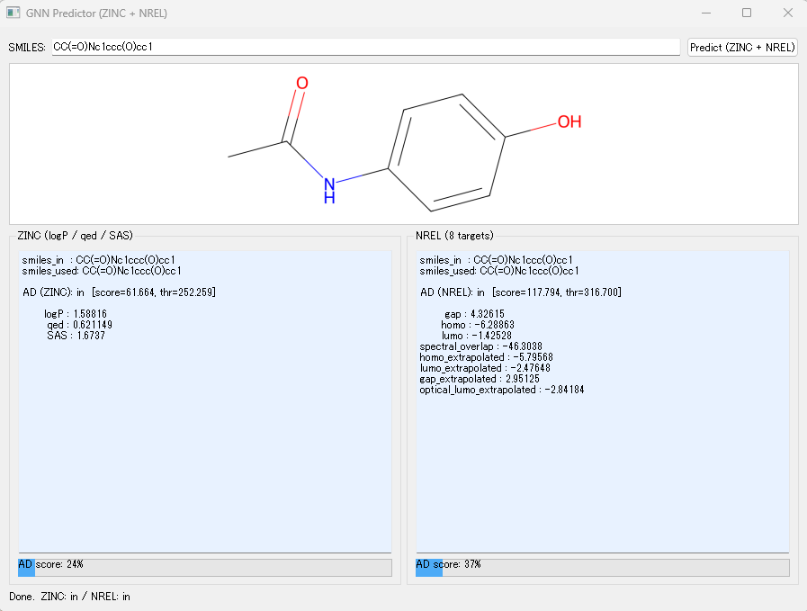
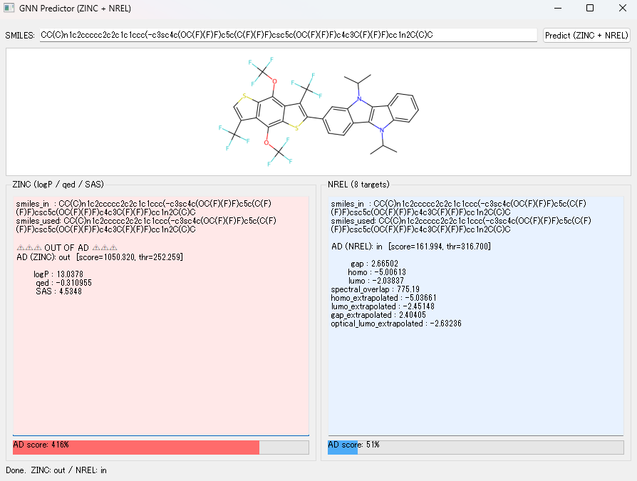
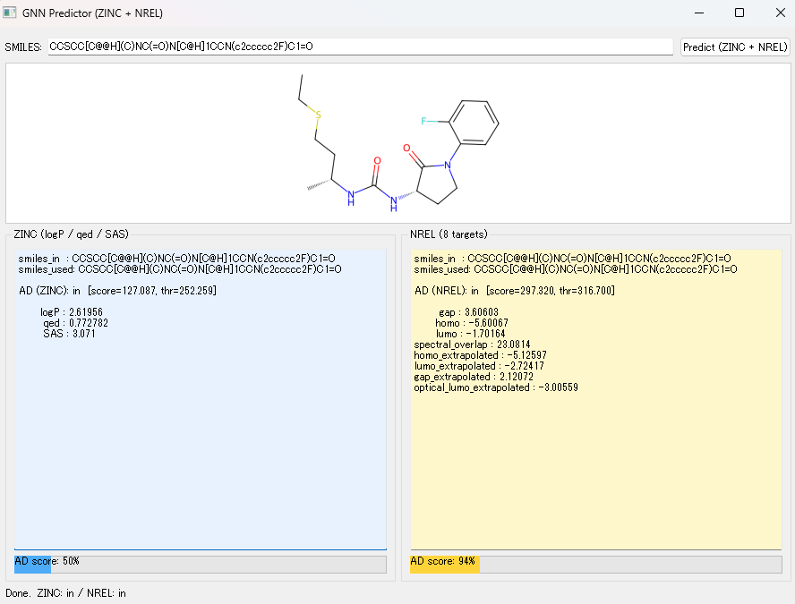

# GNN-based Molecular Property Prediction + GUI Inference

This repository provides:
- Jupyter notebooks for training/evaluating GNN models (Dev Container reproducible setup)
- A desktop GUI app for single-molecule prediction (`predict_gui.py`, `gnn_infer.py`)

> **Hardware note**  
> Training notebooks strongly require a GPU, while the GUI runs on CPU only.  
> The GUI runs on a local Miniforge/Conda environment (not inside the Dev Container).

---

## Repository Structure (key files)

- `.devcontainer/`
  - `Dockerfile`, `devcontainer.json`, `environment.yml` (for notebooks / training)
- `*.ipynb`
  - notebooks for training / evaluation / AD
- `predict_gui.py`
  - GUI app (run locally via Miniforge/Conda)
- `gnn_infer.py`
  - inference utilities used by GUI / notebooks

---

## Quick Start A: Notebooks (Dev Container)

### Requirements
- VS Code
- Dev Containers extension (Remote - Containers)

### Steps
1. Open this repository in VS Code.
2. Run **"Reopen in Container"**.
3. Open a notebook (`*.ipynb`) and run cells.

Notes:
- The Dev Container environment is defined by `.devcontainer/environment.yml`.
- Notebooks assume the **repository root** as the working directory.

---

## Quick Start B: GUI (Local Miniforge/Conda)
If pretrained models are available, this GUI application can be used
to predict various molecular properties.


### Requirements
- Miniforge (or Anaconda/Miniconda)
- Windows/macOS/Linux supported (tested primarily on local Conda)

### Environment setup
Create a Conda environment for GUI from a YAML (see "Export Conda YAML" section).
Example:
```bash
conda env create -f environment_gui.yml
conda activate <ENV_NAME>
```

### Run GUI
Run from the repository root:
```bash
python predict_gui.py 
```
Notes:
- The GUI is not guaranteed to run inside the Dev Container.
- Always run `python predict_gui.py` from the repository root(cwd matters).

### Step-by-step Usage

1. Enter a SMILES string
Paste the SMILES representation of the molecule you want to predict into the input field.

2. Run prediction
Click the “Predict (ZINC + NREL)” button.

3. View prediction results
The molecular structure and prediction results will be displayed:
    - Left panel (ZINC model)
Predictions from a GNN trained on the ZINC dataset, providing three drug-like properties
(logP, QED, SAS).

    - Right panel (NREL model)
Predictions from a GNN trained on the NREL dataset, providing eight photovoltaic-related properties.

### Applicability Domain (AD) Evaluation

For each GNN model, an Applicability Domain (AD) is defined based on the distribution of the readout-layer embeddings of the training data.

- A threshold (thr) is determined from the training distribution.

- For an input molecule, an AD score is computed as the Mahalanobis distance in the GNN latent space.

- The AD score is defined as 

$\text{AD score (\%)} = \frac{\text{distance}}{\text{threshold}} \times 100$.


The interpretation is as follows:

- AD score < 100%
→ Inside the applicability domain (similar to training data)

- AD score ≈ 100%
→ Near the boundary of the applicability domain

- AD score > 100%
→ Outside the applicability domain (extrapolation)

A smaller AD score indicates that the molecule is closer to the training data distribution, while a larger value indicates stronger extrapolation.

### Examples
**Example 1: Acetaminophen**

Both ZINC and NREL models produce predictions with small AD scores, indicating that the molecule lies well within the applicability domains of both models (blue bars).
These predictions are therefore considered reliable.

**Example 2: Photovoltaic material**

Predictions are produced by both models; however, the ZINC model shows a large AD score, indicating that this molecule is outside the ZINC applicability domain.
As a result, ZINC-based predictions may be unreliable, while NREL predictions are more appropriate for this molecule.

**Example 3: Drug-like molecule**

The ZINC model prediction lies inside the applicability domain, whereas the NREL model prediction is close to the AD boundary.
In this case, ZINC predictions can be trusted, while NREL predictions should be interpreted with caution.

### Notes

- The progress bar is capped at 500% to visualize the degree of extrapolation.

- Color coding:
  - Blue: safely inside AD
  - Yellow: near AD boundary
  - Red: outside AD (extrapolation)

---

## Data and Model Directories
Large datasets and pretrained model files are not tracked in this repository
due to GitHub file size limitations.

Please prepare the `data/` and `models/` directories locally.
The required datasets can be obtained from the following sources.

### Datasets
- ZINC
  - https://www.kaggle.com/datasets/basu369victor/zinc250k
- NREL
  - https://data.nrel.gov/submissions/236
- Deep4Chem
  - https://figshare.com/articles/dataset/DB_for_chromophore/12045567/2?file=23637518

After downloading the datasets, place them in the following directories:

- `data/zinc/`
- `data/NREL/`
- `data/Deep4Chem/`

Once the datasets are placed in the appropriate directories,
you can run the provided notebooks to preprocess the data
and generate the trained models and AD artifacts.
